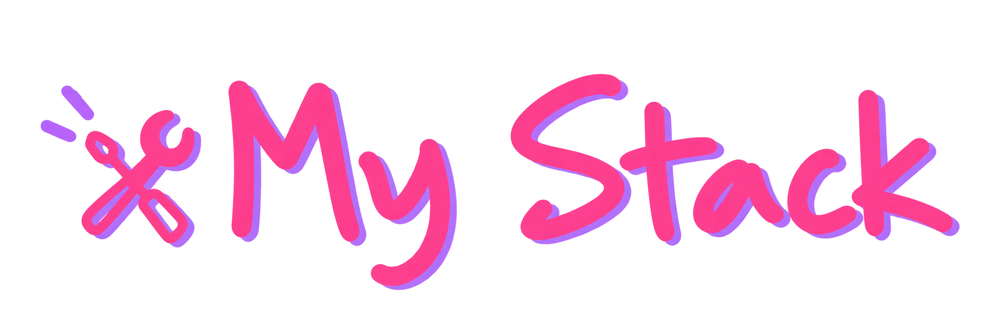
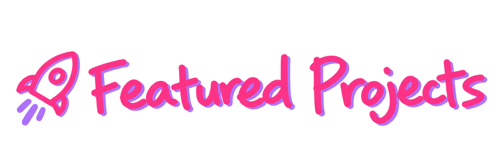

  

### ☁️ Cloud & Cybersecurity Engineer

**Azure Infrastructure · Cloud Security · IAM · Microsoft Security**

Building secure, scalable and resilient cloud environments.

 

  

  

### ☁️ Cloud & Identity

### 🖥️ Infrastructure & Virtualization

### 🛡️ Security & Monitoring

### ⚙️ DevSecOps & Automation

  

Cloud and Cybersecurity Engineer specialized in **Microsoft Cloud & Security**, with hands-on experience across **Azure, AWS, hybrid infrastructure, IAM, virtualization, security operations, endpoint security, DevSecOps, network protection, automation, and resilience**.

- Design, secure, and manage Microsoft Azure and hybrid cloud environments
- Identity & Access Management with Microsoft Entra ID, MFA, Conditional Access, RBAC, PIM, Zero Trust, and PAM
- Security operations with Microsoft Defender, Sentinel, Elastic, Splunk, and security monitoring platforms
- Endpoint security and management with Microsoft Intune, Defender for Endpoint, BitLocker, LAPS, ASR, and EDR
- Infrastructure and virtualization with Windows Server, VMware, Nutanix, Citrix, and hybrid environments
- Network and web security using WAF technologies, Cloudflare, Reblaze, Fortinet, and Cisco security solutions
- Automation and Infrastructure as Code with PowerShell, Bicep, Terraform, Bash, and Python
- DevSecOps and application security practices including SAST, DAST, SCA, secret detection, and CI/CD security
- Security assessments, cloud hardening, governance, monitoring, backup, disaster recovery, and resilience

### ✨ Let's Connect

  

### [LSDR Security Portfolio](https://github.com/LisandraDv/lsdr-security-portfolio)

My cybersecurity portfolio focused on **Cloud Security, DevSecOps, Application Security, Infrastructure Security, and Microsoft Cloud Security**.

Inside this portfolio:

- Secure Code, SAST, SCA & Secret Detection
- Infrastructure as Code Security & Policy as Code
- Container & Kubernetes Security
- DAST & Continuous Security Monitoring
- Azure & Microsoft 365 Security Hardening

[Explore the Full Portfolio →](https://lisandradv.github.io/lsdr-security-portfolio/)

 

  

- Microsoft Certified: Azure Fundamentals — **AZ-900**
- Microsoft Security, Compliance, and Identity Fundamentals — **SC-900**
- Fortinet Cybersecurity Certifications
- Cybersecurity technical training and international bootcamps
- Continuous learning in Azure, Cloud Security, IAM and Microsoft Security

  <b>Secure by design. Built for the cloud.</b>

